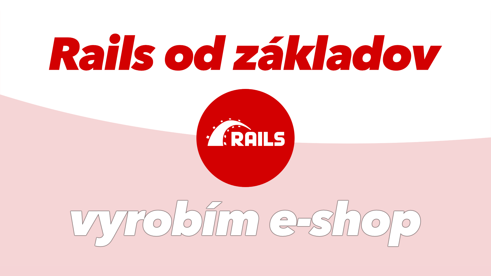

# Rails od základov (kurz)
### ✨ Spravme e-shop v Ruby on Rails

Naučím ťa vytvoriť maličký e-shop v Ruby on Rails. Vysvetlím každý krok. **Dostaneš základy tvorby webových aplikácií. A MVC frameworkov. A REST architektúry.** Použitím Rails. V krásnom jazyku Ruby. Používateľ vie pridávať, upravovať a mazať produkty. Návštevníci im vedia pridať recenzie a hviezdičkové hodnotenia. Ukážem generovanie kódu, ovládanie aplikácie cez konzolu, validáciu formulárov, upload obrázkov, automatickú tvorbu thumbnailov a všeličo ďalšie.  
  
Kopu kódu napíše Rails za mňa. Pretože v tom je dobrý.  
   
Ruby on Rails je **dlhodobo jeden z najpopulárnejších backend frameworkov**. Nastavil štandard, ktorý ostatní kopírovali. Do dnešného dňa prináša unikátne nápady a často kontroverzné prístupy k riešeniu problémov.  
  
Služby ako **Twitch, GitHub a Airbnb** stoja na **Rails**.  

---

### VIDEO, kde ťa naučím Rails, krok za krokom:
  
:: https://youtu.be/upQ5-1syuJU

[](https://youtu.be/upQ5-1syuJU)
  
V branchoch vidíš, ako sa kód vyvíjal.

---

Ak si učiteľ, môžeš tento kód a video používať na škole, ako len chceš. Enjoy!  
  
Ak ma chceš podporiť, a nemusíš byť učiteľ, **hoď po mne groš cez ♥️ [patreon](https://www.patreon.com/yablko)**.  
Sľubujem, že to možno nie je kult a patróni majú moje videá a kurzy skôr. Majú niekoľko bonusových kurzov a všetky si môžu stiahnuť aj ako text. A dávam im tipy, rady, odporúčania, backstage veci a spomínal som, že to možno nie je kult? 


---

### Inštalácia Rails

Moji [patróni](https://www.patreon.com/yablko) majú 20 minútový bonusový kurz o tom, ako nainštalovať Rails na Windows. Ak ho chceš, pridaj sa na patreon.

Tu je zopár zdrojov ako Rails (a Ruby) nainštalovať a spojazdniť. Google je každopádne tvoj kamarát. Ja som zlučoval rôzne zdroje, pokusy a plieskania hlavy o steny kým sa to nepodarilo. Prípadne skús pootravovať ľudí z http://rubyslava.sk/ verím, že príde pomoc. Ak by bola potrebná.  


.
.
.

Na Intel Macu som musel do **.zshrc** pridať:  

```
export PATH="/usr/local/opt/ruby/bin:$PATH"
export LDFLAGS="-L/usr/local/opt/ruby/lib"
export CPPFLAGS="-I/usr/local/opt/ruby/include"
export PKG_CONFIG_PATH="/usr/local/opt/ruby/lib/pkgconfig"
export PATH="/usr/local/opt/ruby/bin:/usr/local/lib/ruby/gems/3.1.0/bin:$PATH"
```

Na M1 Macu som musel do **.zshrc** pridať:  

```
export PATH="/opt/homebrew/opt/ruby/bin:$PATH"
export LDFLAGS="-L/opt/homebrew/opt/ruby/lib"
export CPPFLAGS="-I/opt/homebrew/opt/ruby/include"
export PKG_CONFIG_PATH="/opt/homebrew/opt/ruby/lib/pkgconfig"
export PATH="/opt/homebrew/opt/ruby/bin:/opt/homebrew/lib/ruby/gems/3.1.0/bin:$PATH"
```

---

### KURZY, ktoré spomínam vo videu (trochu si spravím reklamu)
  
HTML a CSS od základov https://youtu.be/LULd0858mUQ  
WEBREBEL kurz tu https://skillmea.sk/kurzy/webrebel-1-html-css-javascript  
Tailwind CSS kurz https://skillmea.sk/kurzy/tailwind-css  
Základy programovania a OOP kurz https://skillmea.sk/kurzy/zaklady-programovania-a-oop  
Laravel kurz https://skillmea.sk/kurzy/webrebel-3-oop-a-laravel  
Všetky moje learn2code kurzy https://skillmea.sk/lektor/roman-hraska 1300+ videí  
  
Skús webrebel ZDARMA https://www.youtube.com/playlist?list=PL3VwAXKvhemVw5DnAqeGbZx5AgEQT27xF  
Tu nájdeš kopu ukážok z mojich kurzov, skús si ich ZDARMA https://www.youtube.com/c/Yablko/playlists?view=1&sort=dd&shelf_id=0  

---

### Odkazy ukázané vo kurze    
  
https://rubyonrails.org  
https://guides.rubyonrails.org  
https://api.rubyonrails.org  
  
https://guides.rubyonrails.org/getting_started.html#creating-a-new-rails-project-installing-rails  
https://guides.rubyonrails.org/getting_started.html#hello-rails-bang  
  
https://bulma.io  
https://tailwindui.com/components/ecommerce/components/product-overviews  
https://unsplash.com  
http://svgicons.sparkk.fr  
https://copypastecharacter.com/all-characters  
  
https://trix-editor.org  
https://guides.rubyonrails.org/action_text_overview.html  
https://github.com/libvips/libvips  
https://guides.rubyonrails.org/active_storage_overview.html  
https://guides.rubyonrails.org/active_storage_overview.html#has-one-attached  
https://edgeguides.rubyonrails.org/upgrading_ruby_on_rails.html#active-storage-default-variant-processor-changed-to-vips  
  
https://loremipsum.io/ultimate-list-of-lorem-ipsum-generators  
https://developer.mozilla.org/en-US/docs/Web/HTML/Element/article  
https://brew.sh  
  
https://youtu.be/gocwRvLhDf8  
https://youtu.be/mpWFrUwAN88  
https://www.youtube.com/channel/UCUkM9uMpWatT7gVWShgtKFw/videos  
https://www.youtube.com/c/Deanin  
  
https://github.com/norman/friendly_id  
https://norman.github.io/friendly_id  
https://github.com/faker-ruby/faker  
  
---  
  
### Chceš sa zlepšiť v programovaní?  

Chyť môj kód a vylepši.  
Pár nápadov, čo s ním môžeš spraviť:  
  
**a) KLÁVESNICA + MOBILE**
  
Kód musí fungovať aj na mobiloch.    
Väčšina toho je hotová. Zvyšok dokonči.   
  
**b) animationend**  
  
Prerob judgeResult() na animationend.    
Vo videu poviem prečo. A poviem to aj tu: je to lepšie.    
  
**c) FARBOSLEPÝ REŽIM**  
  
Nie každý jasne vidí rozdiel medzi týmito farbami.  
Pridaj farboslepý režim.  
Nech každý môže hrať komfortne.  
    
**d) RIEŠENIE ZA BOARDOM**  
  
Keď board vypadne, odhalí sa riešenie.  
Ako keby celý čas svietilo za ním.  
  
**e) ŠTATISTIKY**  
  
Toto je pokročilé. Meraj koľko pokusov človek potreboval.  
Meraj streak. Že koľko správne trafil po sebe.  
Meraj percentuálnu úspešnosť.  
Meraj čas, ako dlho trvalo riešenie.  
  
**f) RAZ DENNE**  
  
Wordle každý deň vyberie jedno slovo.  
Môžeš hádať len raz denne.  
Sprav to!  
  
**g) FRAMEWORK**  
  
Prerob to do Vue.js, Svelte, Reactu.   
Prerob to do čohokoľvek, čo sa chceš naučiť.  
Ja to robím, keď sa učím niečo nové.  
Skúsim v tom vyrobiť skutočnú vec.  

**h) CHYBNÁ ANIMÁCIA**  

Nech sa použité písmená dole v klávesnici vyznačia až po skončení animácie.  
Teraz bliknú hneď na farbu, už pocaš toho, ako sa písmená hore otáčajú.  
  
**Plus - a toto je dôležitejšie - nevyznačuje sa správny počet písmen.**  
V kóde kurzu ak sa písmeno v slove opakuje, vyznačí sa len prvé.  
V kurze ti hovorím, že oprav to. A hovorím to znova, tu!  

**i) UKLADAJ SLOVÁ**  

Teoreticky sa môže stať, že hra vyberie po sebe to isté slová.  
Ukladaj slová, ktoré už boli použité.  
Aby sa vždy vyberali nové a nové slová.  
  
**j) 6 PÍSMEN**  
  
Prerob hru na 6 písmenové slová.  
Reálne - prerob hru všeobecne. Na N-písmenové slová.  
Ak zadáš, že chceš 3 písmená, nakreslí sa 3-písmenová herná plocha.  
A tak!  
  
**k) VYMYSLI SI VLASTNÉ ÚLOHY**  
Lepšie, ako moje.  
Tak sa učíš!
  
♥️
